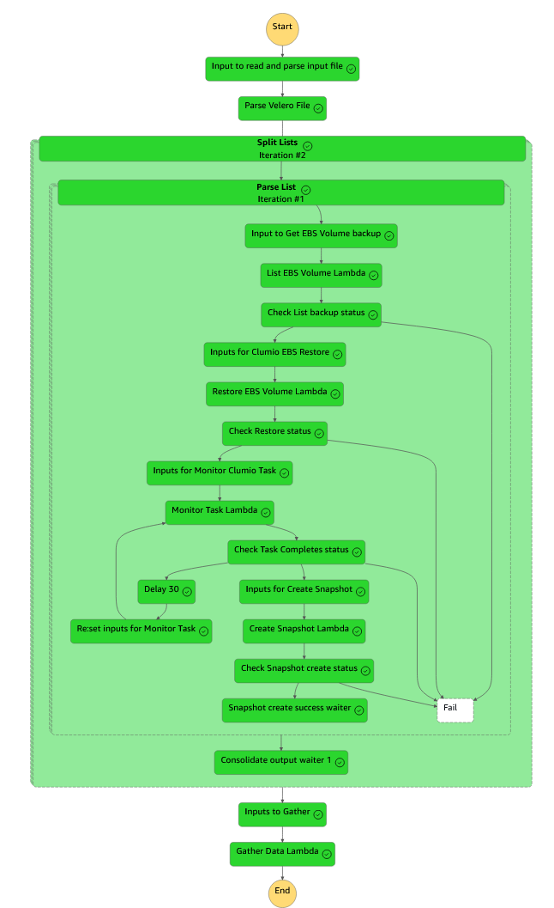

# Clumio solution to support EKS restore of persistent EBS volumes in conjunction with Velero between AWS Regions

> [!IMPORTANT]
> Copyright 2024, Clumio Inc. 
> Licensed under the Apache License, Version 2.0 (the "License");
> you may not use this file except in compliance with the License.
> You may obtain a copy of the License at
>    http://www.apache.org/licenses/LICENSE-2.0
> Unless required by applicable law or agreed to in writing, software
> distributed under the License is distributed on an "AS IS" BASIS,
> WITHOUT WARRANTIES OR CONDITIONS OF ANY KIND, either express or implied.
> See the License for the specific language governing permissions and
> limitations under the License.

> [!NOTE]
> ZIP file clumio_eks_ebs_restore_sa.zip contains all of the code for the lambda functions and the step function.  This zip file must be uploaded
>  to a S3 bucket where it can be accessed by the CFT template when you deploy the solution

> [!NOTE]
> Python files are includes in this github repository for information purposes only.
> This python code reprsents the contents of the lambda functions used by the state machine.
> This code along with non-default python packages are bundled in the ZIP file that is required to run the CFT.

> [!NOTE]
> JSON file example_step_function_inputs.json is an example of the inputs required to run the step function
> These inputs would be modified to reflect your environment


> [!NOTE]
> An IAM role that has permissions to execute the step function and the lambda fucntions (and to write to CloudWatch for logging purposes) must be identified/created before
> you deploy the CFT template.  If required, you can modify the permission of this IAM role after all of the resources have been created to scope those permissions
> to achieve least privledge.

> [!NOTE]
> YAML file clumio-eks-ebs-restore-deploy-cft-sa.yaml is the CloudFormation (CFT) deployment template.  Deploy this CFT template to setup the solution

## Build

To build you will need a Unix type shell (`bash`, `zsh`, ...), Python 3.12, `make` and `zip`.

```bash
make build
```

It will fetch the dependencies and generate the zip file `clumio_velero_restore.zip`
under the `build` directory alongside the `clumio-eks-ebs-restore-deploy-cft-sa.yaml`
CloudFormation template.

The zip file must be uploaded to a S3 bucket where it can be accessed by the
CloudFormation Template when you deploy the solution.


> [!TIP]
> - [ ] A Clumio backup of each of the EBS resources in the Velero backup file must exist for the automation to complete successfully. 
> - [ ] Identify a S3 bucket where zip file can be copied.
> - [ ] Identify an IAM Role that has the capability to run both the lambda functions and the state machine
> - [ ] Add an AWS secret which has the clumio api token to access clumio service. token / <api_token>
> - [ ] Copy ZIP file from the git repository to the S3 bucket
> - [ ] Run the CFT YAML file.  You will need to enter the S3 bucket and IAM role, AWS secret ARN as parameters to run the CFT YAML file
> - [ ] Create an input JSON file for the state machine based upon the example JSON and the descriptions below
> - [ ] Execute the State machine and pass it your input JSON.
> - [ ] Snapshots for all of the EBS resources identified in the backup file are created in the targe location.
> - [ ] Last step of automation updates the Velero backup file (URI) with new snapshot ids



> [!WARNING]
> FOR EXAMPLE PURPOSES ONLY


| Input Parameter          | Description                                                                                   |
|--------------------------|-----------------------------------------------------------------------------------------------|
| velero_file_s3_uri       | URI location of original Velero backup file                                                   |
| velero_file_s3_uri_test  | If you dont want to overwrite the original file, URI location to write new Velero backup file |
| velero_file_segment_size | Step function batch job size - maximum value is 40                                            |
| bear                     | Clumio API bearer token https://help.clumio.com/docs/api-tokens. Leave empty if using secret. |
| base_url                 | The base url of the Clumio API.                                                               |
| source_account           | AWS account from which the ebs resources where backed up                                      |
| source_region            | AWS region from which the ebs resources where backed up                                       |
| end_search_day_offset    | This represents the offset from the current day to the max search time                        |
| target_account           | AWS account where the ebs resource is to be restored                                          |
| target_region            | AWS region where the ebs resource is to be restored                                           |
| target_aws_az            | required, infrastructure value for restore AWS AZ                                             |
| target_iops              | optional, infrastructure value for EBS iops setting                                           |
| target_volume_type       | optional, infrastructure value for EBS volume type setting                                    |                                     |
| target_kms_key_native_id | optional, infrastructure value for restore AWS KMS key id                                     |

> [!NOTE]
> Optional infrastructure target values may still be required based upon the configuration of the original backed up resource
